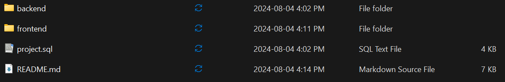
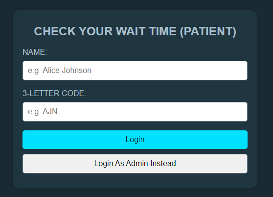

# Project Overview

## Developer's Perspective

### Setting up the application

_Note that we reccomend using a windows machine to run the application_

#### Extracting the files

Prior to the setup and configuration, make sure to extract all the files from the zip folder. Extract it to a locatino that you can easily find. Upon successful extraction, you should be able to see the file struture.

_backend_ contains all the code to provide a RESTful API for the client. It is responsible for database interacting with the database and responding to HTTP requests from the client.

_frontend_ contains all the code that represents the client (user). It is where the React code lives to provide the UI and allows the user to make requests to the server.

_project.sql_ is a file that can be run on MySQL workbench to set up the database tables and populate them with initial seed data.

#### Installing the software to run the application

Both the frontend and backend require node.js to run. If you don’t have it already, you can [download](https://nodejs.org/en/download/package-manager) it. Follow the on screen instructions to install it. You can verify it has been downloaded by typing “node -v” and “npm -v”. If your device does not recognize the commands, make sure to add it to your [system path](https://hackmd.io/@hm222vx/AddNodeJSPath). Although, an .msi installer for windows should take care of this.

You must also download and install [MySQL](https://dev.mysql.com/downloads/installer/) along with MySQL Workbench. Follow the on screen instructions to perform a full install, check requirements, download/install products (including MySQL Workbench) etc. A more detailed guide can be viewed (here)[https://www.mysqltutorial.org/getting-started-with-mysql/install-mysql/].

#### Setting up the database

Once MySQL workbench has been installed, you can open it. You must make a new connection with the **connection name** "Hospital Triage DB”, **connection method** “Standard (TCP/IP)”, **hostname** “127.0.0.1” and port “3306”. For now, login with your root username and password. Open this connection in the editor once these steps have been completed. You may have to start the MySQL80 service if the connection can not be established. Logged in as the root user in the newly created database connection, you will have to create a [new user](https://dev.mysql.com/doc/workbench/en/wb-mysql-connections-navigator-management-users-and-privileges.html) with the **username** "triageadmin" and **password** "csi3140jj". Make sure the created user has the right permissions. To do this to go to administration in the left hand panel -> users and priveliges -> triageadmin -> administrative roles -> select all checkboxes and then click apply. Close the connection tab, edit the connection, and change the name of the user to conect with to "triageadmin". Open the connection again and enter the password "csi3140jj". In the editor, go to file > open SQL script. Find _project.sql_ from the folder where you extracted the zip folder and click on it. Then click on the lightning icon to run the script. This should create the tables as well as the seed data within the tables. Refresh the schema window on the left to see the updated database under “hospitaltriagedb”. Upon following these steps, you should be able to see the following components in your MySQL Workbench.

### Running the application

#### Starting the server

To start the server, open your terminal and navigate to the backend directory. Your terminal
should be referencing the backend directory and should look something like this:

Once here, run the command “node app.js” to start the server. If you setup the database properly,
you should see the following:

The server is running on port 4000 at http://localhost:4000. Notice the message “Successfully
connected to the database.”

#### Starting the client

To start the client, open a new terminal and navigate to the frontend directory. Your terminal
should be referencing the frontend directory and look something like this:

Once here, run the command “npm start” to start the react development server. You should see
the following message.

The browser should automatically open to http://localhost:3000/. However, you can manually
go to this URL if it doesn’t. It is highly recommended that you use Google Chrome.
It is important to note that you should have nothing running on any of the previously mentioned
ports prior to following this guide. This includes ports 3306, 4000, and 3000.

## User's Perspective

### Patient

Once the prior steps have been completed and the application is running, you will be greeted with the login page. By default, the login will be for a patient.

To login, enter a patient's name and their 3 letter code. Note that there is basic validation for this and you will be prompted to enter data again if it is not in the database. Patients that you can login in with include (name, code):
- Alice Johnson, AJN
- Bob Smith, BSM
- Carol White, CWH
- David Brown, DBR
- Emma Davis, EDA
- Frank Green, FGR
- Grace Hill, GHL
- Henry King, HKG
- Ivy Lee, ILE
- Jack Miller, JML

Once logged in, you will see the patient's wait time and code.

Simply log out if you want to go back to the login screen.

### Admin

To login in as admin, click the "Login As Admin Instead" button to view the admin login.

Enter the username and password of the admin. Admins you can log in as include (username, passsword):
- admin-1, password1
- admin-2, password2
- admin-3, password3

Once logged in, you can view a list of patients.

Press the "admit" button to admit a patient (treat them) and remove them from the queue.

To add a new patient, press the "Add New Patient to Queue" button and enter their data. Note that the system does not check for exising users so please enter a patient that has not been in the system yet. Also, enter valid data.

Once the patient is added, you will see them in the queue.

Note that both adding a patient and admitting one will affect the wait times.

To log out of admin, press the "Log Out" button to go back to the login screen.
